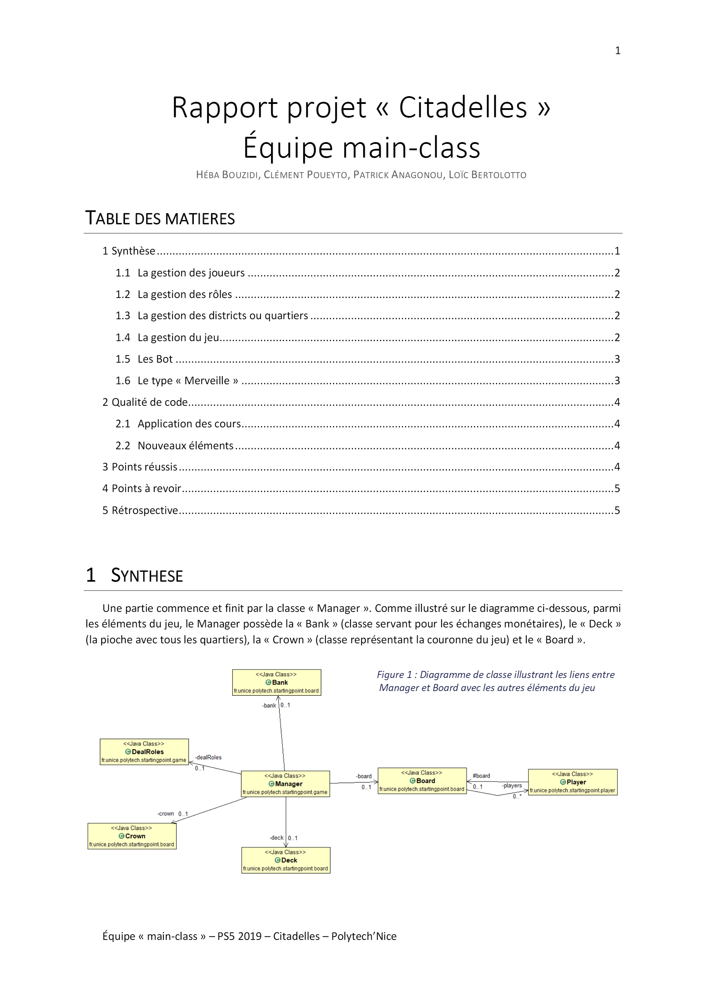
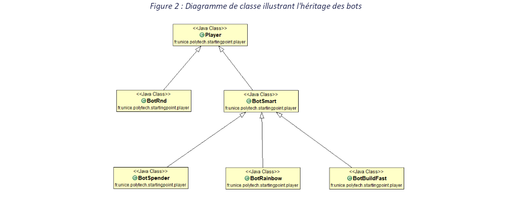

# Projet-Citadelles---SI3
Reproduction du jeu de société Citadelles. Implémentation en Java sans interface graphique .Gestion d'une Intelligence Artificielle avec plusieurs stratégies

# Rapport projet « Citadelles »

# Équipe main-class

##### HÉBA BOUZIDI, CLÉMENT POUEYTO, PATRIC K ANAGONOU, LOÏC BERTOLOTTO

## TABLE DES MATIERES

#### 1 Synthèse .................................................................................................................................................. 1

#### 1.1 La gestion des joueurs ..................................................................................................................... 2

#### 1.2 La gestion des rôles ......................................................................................................................... 2

#### 1.3 La gestion des districts ou quartiers ................................................................................................. 2

#### 1.4 La gestion du jeu .............................................................................................................................. 2

#### 1.5 Les Bot ............................................................................................................................................ 3

#### 1.6 Le type « Merveille » ....................................................................................................................... 3

#### 2 Qualité de code ........................................................................................................................................ 4

#### 2.1 Application des cours ....................................................................................................................... 4

#### 2.2 Nouveaux éléments ......................................................................................................................... 4

#### 3 Points réussis ........................................................................................................................................... 4

#### 4 Points à revoir .......................................................................................................................................... 5

#### 5 Rétrospective ........................................................................................................................................... 5

## 1 SYNTHESE

Une partie commence et finit par la classe « Manager ». Comme illustré sur le diagramme ci-dessous, parmi
les éléments du jeu, le Manager possède la « Bank » (classe servant pour les échanges monétaires), le « Deck »
(la pioche avec tous les quartiers), la « Crown » (classe représentant la couronne du jeu) et le « Board ».

```
Figure 1 : Diagramme de classe illustrant les liens entre
Manager et Board avec les autres éléments du jeu
```



### 1.1 LA GESTION DES JOUEURS

Dans le jeu il faut que chaque joueur puisse avoir le moyen de faire des recherches sur les autres joueurs.
Pour cela, nous avons Board qui est une classe « intermédiaire » servant aux joueurs uniquement, plus
précisément à leurs réflexions. En effet, elle ne possède qu’une liste de joueurs et des méthodes servant à
identifier un joueur correspondant à certains critères (i.e quel est le joueur le plus riche).

### 1.2 LA GESTION DES ROLES

```
Les rôles sont créés à partir d’une classe abstraite « Role », et chaque type de rôle est une classe qui en
```
#### hérite. Cela permet d’ajouter facilement d’autres rôles pour d’autres versions du jeu.

La gestion des rôles se fait via « DealRoles ». Cette classe fournit les fonctions pour le mélange des rôles, la
définition les rôles cachés, visibles, la réinitialisation des rôles à la fin d’un tour... C’est une classe instanciée dans
Manager.

### 1.3 LA GESTION DES DISTRICTS OU QUARTIERS

Tous les districts sont implémentés. Ils sont instanciés par « DistrictsInput » qui récupère les informations
nécessaires contenus dans un fichier au format json. C’est la classe Deck qui permet de gérer le retrait et la
remise de quartier

### 1.4 LA GESTION DU JEU

C’est le Player qui gère le déroulement de son tour à l’appel du Manager, et c’est donc le Manager qui
organise le déroulement du jeu. Le Manager n’interfère pas avec le tour d’un joueur.

A l’aide du design pattern Observer, à chaque fin de tour d’un joueur, ce-dernier prévient le Manager s’il a
construit les 8 quartiers ou plus, ou si le Deck est vide. Dans ce cas, le Manager prévoit de finir la partie après
que tous les joueurs ont effectué le tour de table en cours.


### 1.5 LES BOT

```
Figure 2 : Diagramme de classe illustrant l'héritage des bots
```



```
Comme demandé, nous avons 4 bots avec des stratégies différentes :
```
- un Bot « BotRnd » qui effectue des choix aléatoires,
- un Bot « BotBuildFast » qui fera tout pour finir en premier pour le bonus à 4 points (il aura tendance à
    construire des quartiers « low cost »),
- un Bot « BotSpender » qui visera les quartiers valant le plus,
- et un Bot « BotRainbow » qui visera le bonus à 3 points en construisant une cité comportant toutes les
    couleurs (s’il n’a pas moyen d’améliorer ce bonus lors d’un choix, il adoptera la stratégie du Spender).

BotRnd hérite de Player. BotBuildFast, BotSpender, BotRainbow héritent quant à elles de « BotSmart » qui
elle-même hérite de Player. Étant donné qu’il y a des raisonnements en commun, et des méthodes qui n’ont pas
leur place dans Player, nous avons préféré créer BotSmart en tant qu’intermédiaire.

La classe Player définit les actions qu’effectue un joueur tel que le jeu le décrit (piocher des pièces, des cartes,
défausser des cartes, choisir un personnage...), et définit aussi des méthodes à réécrire par les bots pour
déterminer _quoi_ piocher, défausser, choisir (comme personnage), etc. Ainsi les bots doivent redéfinir
uniquement les « méthodes de réflexion », laissant la superclasse s’occuper de _comment_ appliquer la décision.

### 1.6 LE TYPE « MERVEILLE »

Nous avons aussi implémenté les quartiers de type Merveille avec leurs effets. Pour simplifier son utilisation,
la Manufacture n’est utilisable qu’au moment où le joueur choisit de piocher, et non pas à n’importe quel
moment du tour, comme semblent l’indiquer les règles du jeu. De même nous avons instauré un ordre arbitraire
entre l’utilisation des effets d'Observatoire, Manufacture et Bibliothèque puisque les règles ne précisent pas
quoi faire lorsqu’un joueur a plusieurs de ces cartes.


## 2 QUALITE DE CODE

### 2.1 APPLICATION DES COURS

Nous utilisons beaucoup de listes. Pour les gérer, nous avons utilisé la classique boucle for(), mais aussi
forEach(), stream(), filter(), des lambda... Plusieurs techniques apprises en POO pour gagner en lisibilité, et en
lignes de code.

Nous avons beaucoup utilisé Mockito pour nos tests unitaires, mais nous n’avons sûrement pas tiré tout le
potentiel de ce Framework. Nous avons par ailleurs eu des difficultés à décider s'il fallait ou non tester
DistrictsInput (la classe qui lit le fichier et instancie les Districts à partir des infos du fichier) et comment serait-
elle testée. Finalement nous ne l’avons pas fait, mais les tests du Deck permettent de détecter d’éventuels
problèmes avec DistrictsInput.

Au niveau des responsabilités, nous avons souvent changé la structure de notre projet pour améliorer ce
point. Même à ce jour, nous ne pouvons pas dire que notre solution est la plus optimale, mais nous avons fait
en sorte que les responsabilités de chaque classe aient du sens.

Pour l’affichage du jeu, nous avons décidé d’utiliser l’API de logging de Java. Ce système d’affichage est très
utile : nous pouvons tenir plusieurs journaux de log entre les différentes classes, et afficher celui que l’on
souhaite. Nous avons opté pour deux journaux : un permettant d’afficher le déroulement complet d’une partie
et l’autre permettant d’afficher uniquement les statistiques de victoire des bots sur plusieurs parties.

### 2.2 NOUVEAUX ELEMENTS

Nous avons découvert l’existence des « Optionals », qui permettent de mieux traiter les cas où une méthode
renvoie un objet inexistant. La valeur retournée sera toujours « vide » mais traitable. Cela permet de rendre le
code plus lisible en limitant les vérifications « !=null » dans le code.

L’utilisation du design pattern Observer expliquée plus tôt nous a été d’une grande aide pour réaliser l’arrêt
de la partie, de manière simple et propre.

## 3 POINTS REUSSIS

Les tâches ont été correctement réparties au sein du groupe, nous n’avons pas souffert de problèmes de
communication majeurs, et avons fait en sorte de rester souder, permettant ainsi d’éviter d’avoir un loup
solitaire.

Nous avons appliqué plusieurs notions vues en cours de POO et de Projet, dont certaines ont été expliquées
plus tôt.

Les duplications de code ont été évitées au maximum, notamment en utilisant au mieux le système
d’héritage. L’exemple le plus concret est le mode de pensée des bots qui ne peut pas être distinct l’un de l’autre.
Dans certains cas, ils effectueront le même raisonnement. Grâce à BotSmart, plusieurs méthodes n’auront pas
besoin d’être réécrites pour chaque stratégie.

De plus, avoir un « template » commun à tous les bots permet de créer autant de bots différents que l’on
souhaite, et de les faire jouer ensemble sans difficulté. Il en est de même pour les personnages.

```
Nos tests unitaires ont une couverture dépassant les 90% sur tout le projet.
```
Le concept objet a bien été compris. Le jeu réel comporte un plateau, plusieurs objets, et des joueurs. Notre
solution prend bien le soin d’identifier ces différents éléments comportant le jeu Citadelles, et d’en faire des
classes.


## 4 POINTS A REVOIR

Les effets des quartiers de type « merveille » n’étaient pas la priorité du projet. Toutefois, le potentiel de ces
cartes n’a pas été exploité au maximum. Peut-être qu’avec une meilleure gestion globale de projet, il aurait été
possible d’avoir suffisamment de temps pour mieux gérer ces quartiers spéciaux qui peuvent générer différentes
approches niveau stratégie.

Il en va de même pour les bots : c’est avec les deadlines en tête que nous avons développé au mieux leurs
réflexions. Cependant, nous ne cesserons pas de nous dire que plusieurs améliorations auraient pu être
effectuées, et que nos bots pourraient être encore plus intelligents. Par exemple, le choix de piocher des pièces
ou des cartes s’est résumé à faire des comparaisons avec des valeurs arbitraires. Ce raisonnement aurait pu être
amélioré.

Une optimisation que l’on aurait souhaité implémenter : appliquer le design pattern Strategy pour mieux
abstraire la réflexion des robots et pouvoir leur permettre de changer de stratégie de façon plus transparente.
Mais l’application de ce design soulevait des problèmes de responsabilité (entre « Strategy » et « Player »,
laquelle devait posséder les informations de jeu et comment les partager), et nous craignions de ne pas pouvoir
les résoudre dans le temps restant.

Nous avons eu à faire des compromis entre les tests et l’utilisation des mots clés du langage Java. C’est à dire
que nous aurions voulu utiliser plus d’« abstract » ou de « final » sur certaines méthodes ou classes qui s’y
prêtaient mais cela aurait compliqué la réalisation des tests. En effet, on n’aurait pas pu mocker les méthodes
final et l’instanciation des classes abstraites (utiliser la fonctionnalité des anonymous classes aurait été trop long
et répétitif).

Le découpage des tâches avait mal démarré, au début. Nos premières issues étaient beaucoup trop chargées
et on s’est vite retrouvé en difficulté au moment de rassembler le code et de définir les dépendances et
responsabilités des différentes classes. De même certains commits n’appartiennent à aucune issue.

## 5 RETROSPECTIVE

Nous avons la mauvaise habitude de réaliser des méthodes avant de préparer ses tests. Il est clair que nous
devrions faire le contraire pour la suite, et ainsi changer nos habitudes.

Comme dit précédemment, le découpage en slices est un aspect que l’on devra améliorer, ne serait-ce que
pour les prémices du projet. Sinon, la gestion globale des slices était décente et peut être conservée.

En cette fin de projet, il nous est arrivé qu’à force de modifier une méthode plusieurs fois et par plusieurs
personnes, nous ne savions plus qui avait la « charge » du bon fonctionnement de celle-ci.

Pour la suite nous garderons l’esprit d’équipe dont nous avons fait preuve, qui a bien aidé la communication
au sein du groupe.

